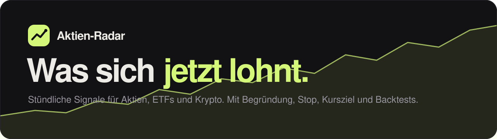

<div align="center">

<picture>
  <source media="(prefers-color-scheme: dark)" srcset="docs/banner-dark.svg">
  <source media="(prefers-color-scheme: light)" srcset="docs/banner-light.svg">
  
</picture>

<a href="https://maximilianfeix.github.io/aktien-radar/"></a>

[Deutsch](README.md) · **English**

</div>

---

**Aktien-Radar** scores about 240 stocks, ETFs and coins every hour with rules that have decades of published evidence behind them, explains in plain language what currently ranks best, and keeps an open record of how its signals did afterwards. The page itself is in German.

The bot does not trade. It gives you candidates with a reason, a stop and a price target. The decision stays with you.

> [!WARNING]
> Not investment advice. Past returns do not predict future returns. You can lose all the money you invest.

## What it does

- **Top picks** for a short horizon (days to weeks) and a long one (months to years), each with entry, stop, target and reasons
- **Market traffic light**: index trends, market breadth and volatility in one number
- **Heatmap, screener with presets, comparison chart, sector table, earnings dates**
- **Detail view** per asset: price chart with 50- and 200-day averages, key figures, position size calculator
- **Portfolio check**: enter your positions and see what the radar says. Stays in your browser
- **Live record**: every buy signal is tracked from the moment it appears until it ends
- **Signal changes** as a list, an Atom feed and push messages (ntfy, Discord, Telegram)
- **Backtests** of ten strategies with costs, reported separately for the period up to 2020 and since 2021

## How a signal is made

1. Only assets above their 200-day average with positive 6- and 12-month returns can become a buy.
2. A score from 0 to 100 combines momentum, trend, low volatility, distance to the 52-week high and, for stocks, quality and valuation.
3. The stop sits 2.5 average daily ranges (ATR) below the price, the target twice as far above.
4. Parameters come from the literature and are not tuned on this data.

## Backtests

| Strategy | Return p.a. overall | Return p.a. since 2021 | Sharpe since 2021 | Largest drawdown |
|---|--:|--:|--:|--:|
| Buy and hold S&P 500 | +14.9 % | +14.5 % | 0.91 | −34 % |
| **ETF rotation top 3** (core strategy) | +9.9 % | +11.7 % | 0.91 | **−19 %** |
| Dual momentum | +9.4 % | +10.5 % | 0.74 | −34 % |
| Trend following S&P 500 | +7.7 % | +8.0 % | 0.70 | −26 % |

Buying an S&P 500 ETF and holding it was not beaten on raw return. The rules mainly deliver smaller drawdowns. Momentum tests on single stocks and coins look far better, but they use today's universe and are therefore flagged as biased on the page.

## Run it yourself

It runs entirely on GitHub Actions and GitHub Pages. Fork the repo, set Pages to "GitHub Actions", give workflows read and write permission, edit [`radar/universe.json`](radar/universe.json) and start the *Radar-Update* workflow once.

```bash
pip install -r requirements-dev.txt
python -m radar run
python -m http.server 8000 --directory docs
```

## Data

Everything the page shows is an open file: [`latest.json`](https://maximilianfeix.github.io/aktien-radar/data/latest.json), [`backtests.json`](https://maximilianfeix.github.io/aktien-radar/data/backtests.json), [`track.json`](https://maximilianfeix.github.io/aktien-radar/data/track.json), [`feed.xml`](https://maximilianfeix.github.io/aktien-radar/feed.xml).

## License

[MIT](LICENSE)
