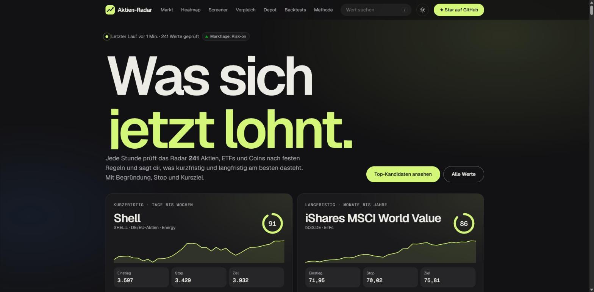
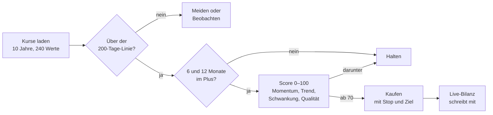

<div align="center">

<picture>
  <source media="(prefers-color-scheme: dark)" srcset="docs/banner-dark.svg">
  <source media="(prefers-color-scheme: light)" srcset="docs/banner-light.svg">
  
</picture>

[](https://github.com/maximilianfeix/aktien-radar/actions/workflows/ci.yml)
[](https://github.com/maximilianfeix/aktien-radar/actions/workflows/radar.yml)
[](https://maximilianfeix.github.io/aktien-radar/#werte)
[](https://maximilianfeix.github.io/aktien-radar/#markt)
[](pyproject.toml)
[](LICENSE)
[](https://github.com/maximilianfeix/aktien-radar/stargazers)

**Top-Kandidaten gerade:**
[](https://maximilianfeix.github.io/aktien-radar/#picks)
[](https://maximilianfeix.github.io/aktien-radar/#picks)

<a href="https://maximilianfeix.github.io/aktien-radar/"></a>
<a href="https://github.com/maximilianfeix/aktien-radar/issues?q=label%3Atagesbericht"></a>
<a href="#selbst-betreiben"></a>
<a href="#daten-mitnehmen"></a>

**Deutsch** · [English](README.en.md)

[Was es kann](#was-es-kann) · [So entsteht ein Signal](#so-entsteht-ein-signal) · [Backtests](#backtests) · [Benachrichtigungen](#benachrichtigungen) · [Selbst betreiben](#selbst-betreiben) · [FAQ](#faq)

</div>

---

Die meisten Trading-Bots versprechen Rendite und liefern einen Backtest, der so lange angepasst wurde, bis er gut aussah. **Aktien-Radar** macht das Gegenteil: Es bewertet jede Stunde rund 240 Aktien, ETFs und Coins nach Regeln, die seit Jahrzehnten in der Finanzforschung belegt sind, sagt dir in Klartext, was gerade am besten dasteht, und schreibt offen mit, wie seine Signale danach gelaufen sind.

Der Bot handelt nicht selbst. Er liefert Kandidaten mit Begründung, Stop und Kursziel. Die Entscheidung bleibt bei dir.

<div align="center">
<a href="https://maximilianfeix.github.io/aktien-radar/"></a>
</div>

> [!WARNING]
> Keine Anlageberatung. Vergangene Renditen sagen die Zukunft nicht voraus. Verluste bis zum Totalverlust sind möglich.

<a id="was-es-kann"></a>

## Was es kann

| | |
|---|---|
| **Top-Kandidaten** | Kurzfristig (Tage bis Wochen) und langfristig (Monate bis Jahre), jeweils mit Einstieg, Stop, Kursziel und Begründung |
| **Markt-Ampel** | Trend der Indizes, Marktbreite und Nervosität (VIX) in einer Zahl von 0 bis 100 |
| **Kernstrategie** | Was die im Backtest beste Strategie gerade hält |
| **Heatmap** | Alle Werte auf einen Blick, über 1 Tag, 1 Monat oder 12 Monate |
| **Screener** | Filter nach Markt und Signal, dazu Vorlagen wie „Rücksetzer im Aufwärtstrend" oder „Dividende im Aufwärtstrend" |
| **Detailansicht** | Kurschart mit 50- und 200-Tage-Linie, 52-Wochen-Spanne, Kennzahlen, Quartalstermin, Rechner für die Positionsgröße |
| **Vergleich** | Bis zu vier Werte übereinander, auf 100 normiert |
| **Sektoren und Termine** | Welche Branchen laufen, wo Quartalszahlen anstehen |
| **Depot-Check** | Eigene Positionen eintragen; das Radar prüft Trend, Streuung, Klumpen und anstehende Zahlen. Bleibt im Browser |
| **Live-Bilanz** | Jedes Kaufsignal wird ab Erscheinen mitgeschrieben und beim Ende abgerechnet |
| **Signalwechsel** | Was hoch- oder herabgestuft wurde, als Liste, Atom-Feed und Push-Nachricht |
| **Nachrichtenlage** | Eine Claude-Routine recherchiert zu den Top-Kandidaten und verlinkt jede Aussage mit ihrer Quelle |
| **Backtests** | Zehn Strategien, mit Kosten, getrennt nach „bis 2020" und „seit 2021" |

Dazu: Suche mit `/`, heller und dunkler Modus, CSV-Export, offline nutzbar, als App installierbar.

<a id="so-entsteht-ein-signal"></a>

## So entsteht ein Signal



| Baustein | Befund aus der Forschung | Im Radar |
|---|---|---|
| Momentum (12 Monate ohne den letzten) | Über Jahrzehnte und Märkte belegt, auch nach Veröffentlichung | Kern des Langfrist-Scores (35 %) |
| Trendfilter (200-Tage-Linie) | Senkt vor allem die großen Rückgänge | Bedingung für jedes Kaufsignal |
| Absolutes Momentum | Verhindert, den Besten unter Verlierern zu kaufen | Bedingung für Langfrist-Käufe |
| Gewichtung nach Schwankung | Glättet Momentum und dämpft Crashs | In allen Rotationsstrategien |
| Rücksetzer im Aufwärtstrend (RSI 2) | Kleine, kostenempfindliche Prämie | Teil des Kurzfrist-Scores |
| Qualität und Bewertung | Sinnvolle Ergänzung, kostenlos nicht sauber rückrechenbar | 20 % des Langfrist-Scores bei Aktien, nicht im Backtest |
| LLM als Entscheider | Ergebnisse schwanken stark | Claude erklärt und recherchiert, entscheidet aber nicht |

**Stop und Ziel:** Der Stop liegt 2,5 durchschnittliche Tagesspannen (ATR) unter dem Kurs, das Ziel doppelt so weit darüber. Überkaufte Werte (RSI über 75) werden kurzfristig nur beobachtet. Im Risk-off-Modus sind kurzfristige Aktienkäufe ausgesetzt.

<a id="backtests"></a>

## Backtests

Gerechnet mit 0,1 % Kosten je Umschichtung (Krypto 0,2 %), einem Tag Abstand zwischen Signal und Ausführung und ohne Parameter-Optimierung. „Seit 2021" ist der Zeitraum, den die Regeln nie gesehen haben. Stand: Oktober 2026, die aktuellen Zahlen stehen auf der [Live-Seite](https://maximilianfeix.github.io/aktien-radar/#backtests).

| Strategie | Rendite p. a. gesamt | Rendite p. a. seit 2021 | Sharpe seit 2021 | Größter Rückgang |
|---|--:|--:|--:|--:|
| Buy & Hold S&P 500 | +14,9 % | +14,5 % | 0,91 | −34 % |
| **ETF-Rotation Top 3** (Kernstrategie) | +9,9 % | +11,7 % | 0,91 | **−19 %** |
| Dual Momentum | +9,4 % | +10,5 % | 0,74 | −34 % |
| Trendfolge S&P 500 | +7,7 % | +8,0 % | 0,70 | −26 % |
| RSI(2)-Rücksetzer S&P 500 | +2,5 % | +5,3 % | 0,99 | −19 % |
| Buy & Hold Bitcoin | +63,6 % | +20,4 % | 0,61 | −83 % |
| Trendfolge Bitcoin | +48,1 % | +13,1 % | 0,50 | −65 % |

Die unbequeme Wahrheit steht in der ersten Zeile: Einen S&P-500-ETF zu kaufen und liegen zu lassen war bei der reinen Rendite nicht zu schlagen. Die Regeln bringen vor allem kleinere Rückgänge bei ähnlichem Verhältnis von Rendite zu Risiko.

Die Momentum-Tests auf Einzelaktien und Coins zeigen 24 bis 30 % pro Jahr. Sie sind auf der Seite als **geschönt** markiert und hier bewusst weggelassen: Sie nutzen die heutige Auswahl, also die Gewinner von heute (Survivorship Bias). Renditen sind in Handelswährung gerechnet, Wechselkurseffekte fehlen.

<a id="benachrichtigungen"></a>

## Benachrichtigungen

Ändern sich die Top-Kandidaten, schickt der Lauf eine Nachricht an jeden Kanal, dessen Secret gesetzt ist:

| Kanal | Secrets |
|---|---|
| Handy-Push über [ntfy](https://ntfy.sh), ohne Konto | `NTFY_TOPIC` |
| Discord | `DISCORD_WEBHOOK_URL` |
| Telegram | `TELEGRAM_BOT_TOKEN`, `TELEGRAM_CHAT_ID` |

```bash
gh secret set NTFY_TOPIC --repo maximilianfeix/aktien-radar   # frei gewählter, schwer zu erratender Name
```

Außerdem: Repo beobachten (Watch → Custom → Issues) für Mails zum [Tagesbericht](https://github.com/maximilianfeix/aktien-radar/issues?q=label%3Atagesbericht), oder [`feed.xml`](https://maximilianfeix.github.io/aktien-radar/feed.xml) im Feedreader abonnieren.

<a id="daten-mitnehmen"></a>

## Daten mitnehmen

Alles, was die Seite zeigt, liegt als offene Datei vor:

| Datei | Inhalt |
|---|---|
| [`data/latest.json`](https://maximilianfeix.github.io/aktien-radar/data/latest.json) | Alle Werte mit Scores, Signalen, Stop, Ziel, Marktlage |
| [`data/backtests.json`](https://maximilianfeix.github.io/aktien-radar/data/backtests.json) | Kennzahlen und Kurven aller Strategien |
| [`data/charts.json`](https://maximilianfeix.github.io/aktien-radar/data/charts.json) | Ein Jahr Kurse mit 50- und 200-Tage-Linie je Wert |
| [`data/track.json`](https://maximilianfeix.github.io/aktien-radar/data/track.json) | Live-Bilanz: offene und abgeschlossene Signale |
| [`data/changes.json`](https://maximilianfeix.github.io/aktien-radar/data/changes.json) | Signalwechsel |
| [`feed.xml`](https://maximilianfeix.github.io/aktien-radar/feed.xml) | Atom-Feed der Signalwechsel |

```bash
curl -s https://maximilianfeix.github.io/aktien-radar/data/latest.json \
  | jq -r '.assets[] | select(.long_signal == "Kaufen") | "\(.long_score | floor)  \(.name)"' | sort -rn | head
```

<a id="selbst-betreiben"></a>

## Selbst betreiben

Das Radar läuft komplett auf GitHub Actions und GitHub Pages, ohne Server und ohne Kosten.

1. Repo forken.
2. Unter *Settings → Pages* als Quelle **GitHub Actions** wählen.
3. Unter *Settings → Actions → General* die Workflow-Berechtigungen auf **Read and write** stellen und „Allow GitHub Actions to create and approve pull requests" aktivieren.
4. Eigene Werte in [`radar/universe.json`](radar/universe.json) eintragen (Yahoo-Finance-Ticker).
5. Den Workflow *Radar-Update* einmal von Hand starten. Danach läuft er jede Stunde.

Lokal:

```bash
python -m venv .venv
.venv/Scripts/activate        # Linux/macOS: source .venv/bin/activate
pip install -r requirements-dev.txt
python -m radar run           # rechnet etwa 6 Sekunden, schreibt docs/data/*.json
python -m http.server 8000 --directory docs
pytest && ruff check .
```

<details>
<summary><b>Was jede Stunde passiert</b></summary>
<br>

1. Tageskurse von Yahoo Finance laden, einmal täglich auch Kennzahlen und Quartalstermine.
2. Jeden Wert kurzfristig und langfristig bewerten.
3. Signalwechsel und Live-Bilanz fortschreiben, Backtests neu rechnen.
4. Recherche-Notizen der Claude-Routine prüfen und übernehmen.
5. Ergebnis als Pull Request ins Repo, automatisch gemergt.
6. Tagesbericht-Issue aktualisieren, Push-Nachrichten senden, Seite veröffentlichen.

</details>

<details>
<summary><b>Claude einbinden (optional)</b></summary>
<br>

**Kommentar zum Lauf:** Liegt das Secret `ANTHROPIC_API_KEY` im Repo, schreibt Claude eine kurze Einordnung, sobald sich die Top-Kandidaten ändern. Die Zahlen kommen immer aus den Regeln. Das Modell lässt sich über die Repo-Variable `RADAR_MODEL` ändern.

**Nachrichtenlage:** Eine geplante Claude-Code-Routine recherchiert zu den Top-Kandidaten und legt ihre Notizen als `news.json` auf den Branch `claude/news`. Der Workflow übernimmt nur geprüfte Felder, kappt Texte und lässt ausschließlich `https`-Links durch.

</details>

<details>
<summary><b>Aufbau des Codes</b></summary>
<br>

| Pfad | Inhalt |
|---|---|
| `radar/universe.json` | Beobachtete Werte je Markt |
| `radar/scoring.py` | Scores, Signale, Begründungen, Stop und Ziel |
| `radar/backtest.py` | Strategien und Kennzahlen |
| `radar/regime.py` | Marktlage und Markt-Ampel |
| `radar/track.py` | Signalwechsel, Live-Bilanz, Feed |
| `radar/fundamentals.py` | Kennzahlen, 24 Stunden zwischengespeichert |
| `radar/news.py` | Prüfung der Recherche-Notizen |
| `radar/notify.py` | Push-Nachrichten |
| `radar/ai.py` | Optionaler Claude-Kommentar |
| `docs/` | Die Seite und die erzeugten Daten |
| `.github/workflows/radar.yml` | Stündlicher Lauf |

</details>

<a id="faq"></a>

## FAQ

<details>
<summary><b>Macht mich das reich?</b></summary>
<br>
Nein, und niemand kann das versprechen. Das Radar ordnet Werte nach belegten Regeln und zeigt offen, wie sie abgeschnitten haben. Ob die Signale live funktionieren, zeigt die Live-Bilanz, sobald genug Signale abgeschlossen sind.
</details>

<details>
<summary><b>Warum handelt der Bot nicht selbst?</b></summary>
<br>
Weil ein Fehler dann echtes Geld kostet. Erst wenn die Live-Bilanz über Monate trägt, lohnt es sich, über automatische Orders nachzudenken – und dann zuerst mit Spielgeld.
</details>

<details>
<summary><b>Wie aktuell sind die Kurse?</b></summary>
<br>
Yahoo Finance liefert je nach Börse um einige Minuten verzögert. Die Seite wird jede Stunde neu berechnet. Für Handel im Minutentakt ist sie nicht gedacht.
</details>

<details>
<summary><b>Kann ich eigene Werte hinzufügen?</b></summary>
<br>
Ja: Ticker in <code>radar/universe.json</code> eintragen. Werte ohne ausreichende Kurshistorie werden automatisch ausgelassen und auf der Seite genannt.
</details>

## Roadmap

- Wechselkurse einrechnen, damit Depot und Backtests in Euro stimmen
- Paper-Trading der Kernstrategie mit eigener Kurve
- Backtests mit historischer Index-Zusammensetzung, um die geschönten Tests zu ersetzen
- Mehr Märkte: Rohstoffe, Anleihen, Schwellenländer

## Danksagung

Kursdaten über [yfinance](https://github.com/ranaroussi/yfinance). Die Regeln gehen auf Arbeiten von Jegadeesh und Titman (Momentum), Faber (Trendfolge), Antonacci (Dual Momentum), Barroso und Santa-Clara (Risikosteuerung) und Connors (RSI 2) zurück.

## Lizenz

[MIT](LICENSE)
